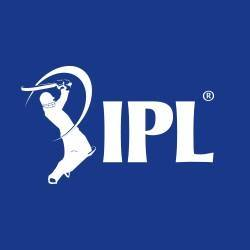

<html>
    <head>
        <title>IPL</title>
        <link rel="stylesheet" href="styles.css">
        <link rel="icon" href="cricket_sport_icon_180212.ico">
    </head>
    <body>
        <header>
            

                
            

            

                <li class="nav_items">
                    <a href="#" class="home">Home</a>
                </li>
                <li class="nav_items">
                    <a href="#" class="about">About</a>
                </li>
                <li class="nav_items">
                    <a href="#" class="stats">Stats</a>
                </li>
                <li class="nav_items">
                    <a href="#" class="contacts">Contacts</a>
                </li>
            

        </header>
    </body>
</html>
